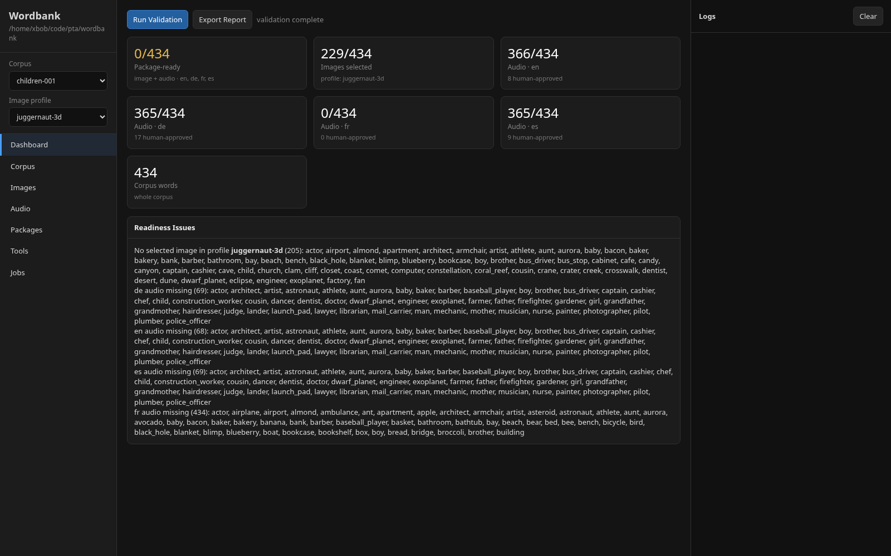
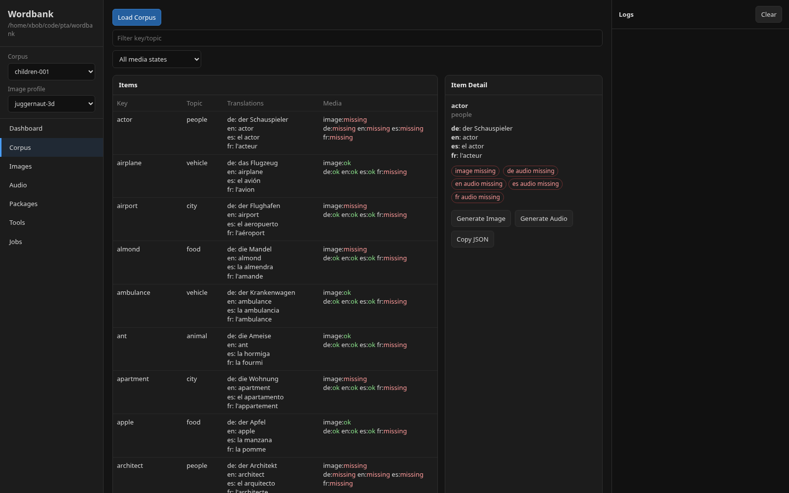
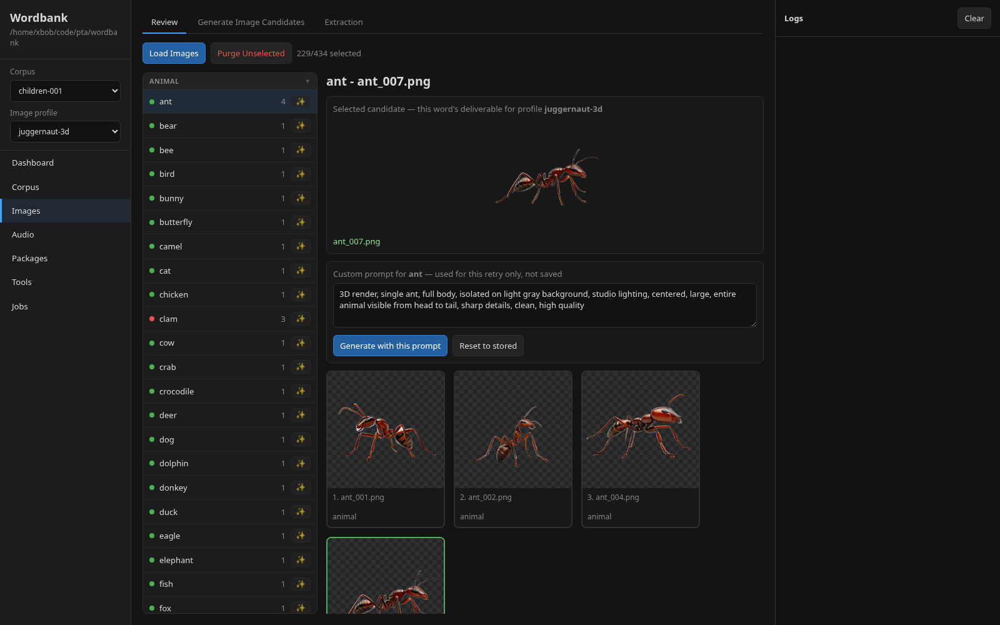
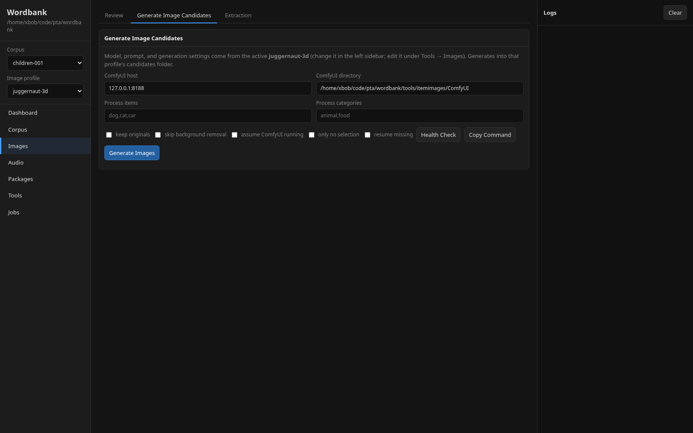
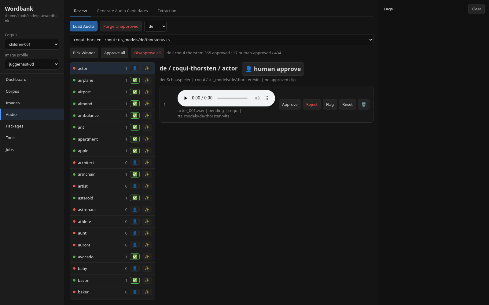
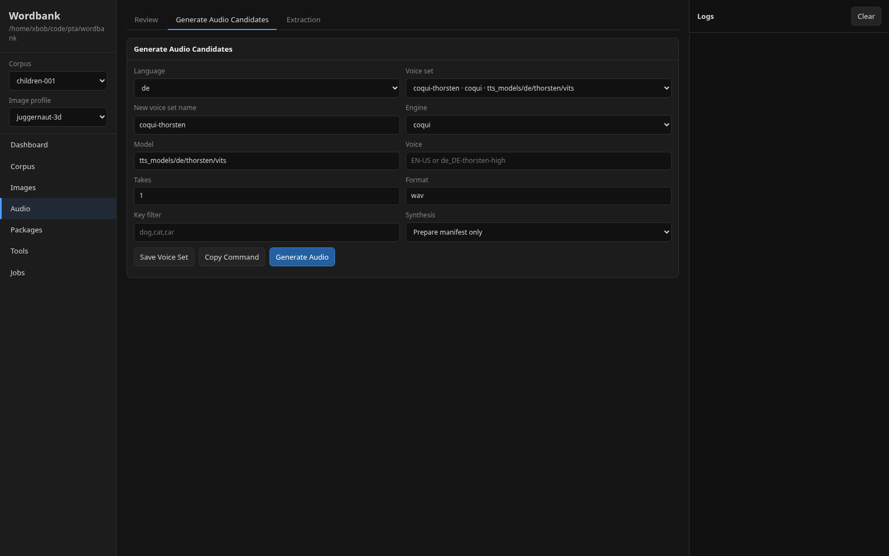
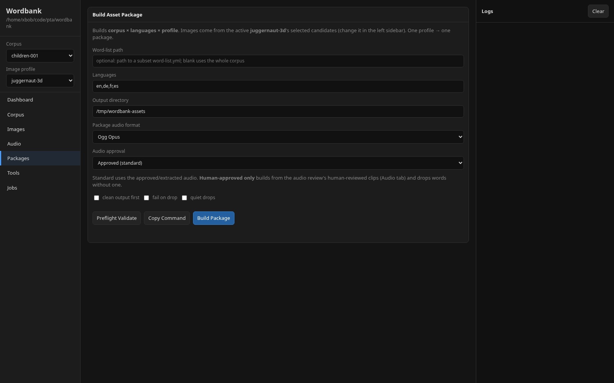
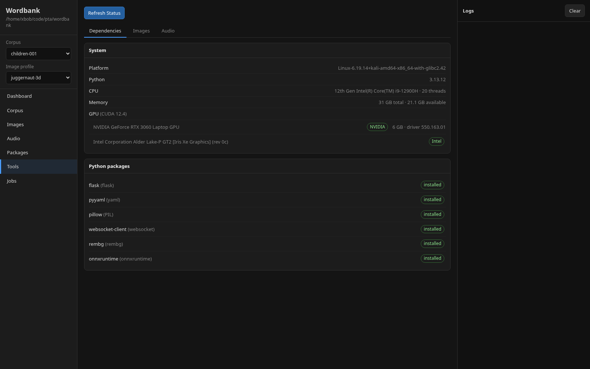
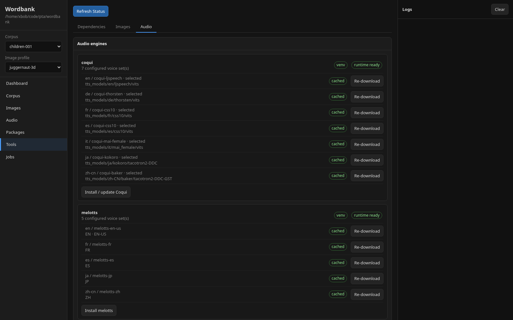
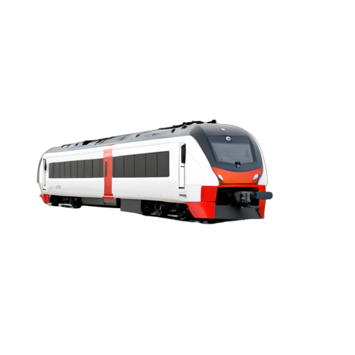

# Wordbank

Wordbank is a **generic image/audio asset generator for apps** (focused on
children's apps). You curate a multilingual word **corpus**, generate and review
**images** (per visual style) and **audio** (per language), then build **packages**
that downstream apps archive in their own repos.

Wordbank itself does **not** keep generated deliverables under source control. The
valuable, tracked parts are the **corpus** (`wordlists/`) and the style **recipes**
(`profiles/`). Everything generated lives under a disposable `output/` directory,
and finished **packages** are written outside the repo (typically straight into a
consumer app's asset folder).

| | | | |
|---|---|---|---|
|  |  |  |  |

<sub>Example renders from the `juggernaut-3d` profile (3D product-render style).</sub>

---

## Table of Contents

- [Core concepts](#core-concepts)
- [How it fits together](#how-it-fits-together)
- [Repository layout](#repository-layout)
- [Quick start](#quick-start)
- [The web UI](#the-web-ui)
  - [Dashboard](#dashboard)
  - [Corpus browser](#corpus-browser)
  - [Images](#images)
  - [Audio](#audio)
  - [Packages](#packages)
  - [Tools](#tools)
- [Profiles (visual styles)](#profiles-visual-styles)
- [The corpus format](#the-corpus-format)
- [Output layout](#output-layout)
- [Packaging & round-trip import](#packaging--round-trip-import)
- [Command-line tools](#command-line-tools)
- [Example renders](#example-renders)

---

## Core concepts

| Concept | What it is | Tracked in git? |
|---|---|---|
| **Corpus** | A multilingual word list (`wordlists/<name>.yml`) with translations and articles. Multiple corpora are supported and selectable. | ✅ Yes — intrinsic data |
| **Profile** | A named **visual style** (model + LoRA + prompt templates + generation settings) under `profiles/<name>/profile.yml`. Two profiles can share a checkpoint but differ in prompt/style. | ✅ Yes — the valuable recipe |
| **Output** | The disposable staging area: generated image candidates and audio takes, plus their review manifests. | ❌ No — gitignored, regenerable |
| **Package** | A built bundle (`words.yml`, `items.yml`, `translations.yml`, media, `manifest.yml`) for one corpus × languages × profile. | ❌ No — archived by the consumer app |

A **build is `corpus × languages × profile`** — three orthogonal axes:

- **corpus** (`wordlists/<name>.yml`) decides *which words*,
- **languages** decide *which translations/audio*,
- **profile** decides *how the images look*.

One profile → one package. Cartoon and realistic styles are always separate
builds, never mixed in one package.

## How it fits together

```
                         ┌────────────────────────────────────────────┐
   tracked in git        │  wordlists/  (corpus)   profiles/ (styles)  │
                         └───────────────┬────────────────┬───────────┘
                                         │                │
                          generate +     ▼  review/select ▼
   gitignored, disposable    ┌─────────────────────────────────────────┐
   output/                   │ output/images/<profile>/candidates       │
                             │ output/audio/<lang>/<voice_set>/*.wav    │
                             └──────────────────┬──────────────────────┘
                                                │  generate_db.py
                                                ▼
   archived by the app       ┌────────────────────────────────────┐
   (outside this repo)       │  package: words.yml + media + ...   │
                             └────────────────────────────────────┘
                                                │  import (round-trip)
                                                ▼
                             re-populates output/ on a fresh checkout
```

Because `output/` is gitignored, a fresh checkout has the **recipe** (corpus +
profile) but no generated media. The archived **package** is the real source of
truth for chosen assets, so:

> **profile recipe (git) + archived package = fully reproducible working state.**

An archived package can be **imported back** into `output/` to review, tweak
individual words, and rebuild — without regenerating everything.

## Repository layout

```
wordbank/
├── wordlists/              # corpora (children-001.yml is the default)         [tracked]
├── profiles/<name>/        # visual-style recipes (profile.yml)               [tracked]
├── manifests/              # seed/approval manifests, article-split review     [tracked]
├── output/                 # generated candidates + review manifests        [gitignored]
│   ├── images/<profile>/candidates/   # raw renders + manifest.json
│   ├── images/<profile>/selected/     # optional "Export Selected" dumps
│   └── audio/<lang>/<voice_set>/      # audio takes + per-voice-set manifest.json
├── generate_db.py          # build an asset package
├── validate.py             # validate corpus + media readiness
├── wordbank_common.py      # shared library (corpus, profiles, selections, import)
├── docs/                   # README screenshots + example renders
└── tools/
    ├── webui/              # the local review/generation web app
    ├── itemimages/         # ComfyUI image pipeline + model setup
    └── itemaudio/          # multi-engine TTS pipeline (coqui/piper/mms/melotts)
        ├── config.yml      #   languages → voice sets (engine/model/voice)
        └── engines/        #   one isolated venv per TTS engine
```

## Quick start

```bash
# 1. Launch the local web UI (opens a browser at http://127.0.0.1:5050)
python tools/webui/app.py

# 2. (Optional) Install the image pipeline — clones ComfyUI + Python deps
python tools/itemimages/setup.py --install
python tools/itemimages/setup.py --download juggernaut-3d   # pull a profile's models

# 3. (Optional) Install a TTS engine for audio (each gets its own venv)
python tools/itemaudio/engines/coqui.py --install

# 4. Build a package from the whole corpus, four languages, active profile
python generate_db.py --langs en,de,fr,es --out /tmp/wordbank-assets --clean
```

The web UI is the primary interface; the CLI tools underneath it are documented
in [Command-line tools](#command-line-tools).

---

## The web UI

```bash
python tools/webui/app.py [--port 5050] [--host 127.0.0.1] [--no-browser]
```

The left sidebar has a **Corpus** selector and an **Image profile** selector that
scope everything, plus navigation to each section. The right rail is a live
**activity log**. Long-running work (generation, packaging) runs as **jobs** with
streamed output (the **Jobs** tab).

### Dashboard



The Dashboard answers one question: **how much is ready to ship?** Click
**Run Validation** to compute readiness for the selected corpus, languages, and
active profile:

- **Package-ready** — the headline number: words that have *both* a selected
  image and approved audio for *every* selected language (turns green at 100%).
  This equals what a build would actually emit.
- **Images selected** — words with a chosen candidate in the active profile.
- **Audio · `<lang>`** — one card per language, with an `N human-approved`
  sub-count.
- **Corpus words** / **Unknown keys** (the latter only appears if a word-list
  references keys not in the corpus).

The **Readiness Issues** panel lists exactly which words are blocking, by
category. **Export Report** writes a Markdown summary.

### Corpus browser



Browse every word in the selected corpus. The table shows each word's **topic**,
**translations** (per language), and **media** state (image + per-language audio,
green = ok / red = missing). Filter by key/topic or by media state ("Missing
image", "Missing audio", "Ready", …).

Selecting a row opens **Item Detail**: full translations, media-state pills, and
shortcuts to **Generate Image** / **Generate Audio** for that word, or **Copy
JSON** of the raw entry.

### Images

Image work is scoped to the **active profile** (the style). Three sub-tabs:

#### Review



The left list shows **every corpus word** grouped by category, with its candidate
count and a ✨ button to (re)generate that word. A grey dot means "no selection
yet"; green means selected — so gaps are obvious. Selecting a word shows:

- the **selected candidate** (the word's deliverable for this profile),
- an editable **custom prompt** (pre-filled with the profile's default for that
  word — used for a one-off retry, not saved),
- the **candidate grid** — click any candidate to select it, 🗑 to delete one.

**Purge Unselected** removes the non-chosen candidates for words that already have
a selection.

#### Generate Image Candidates



Generation reads the active profile's model/prompt/settings and patches the
ComfyUI workflow **in memory per job** — no global switching, so profiles never
collide. The form keeps only run scoping (which items/categories, resume /
needs-selection filters); the style comes entirely from the profile. Output
streams to the Jobs view, and failed items can be retried in one click.

> Image generation needs a running ComfyUI + a downloaded model set (see
> [Tools](#tools)). Wordbank can auto-start ComfyUI from the configured path.

#### Extraction

A convenience export that dumps the selected image per word to a flat folder
(default `/tmp/wordbank-images`). This is **decoupled from packaging** — packages
read selections directly, so you rarely need this.

### Audio

Audio is organized by **language × voice set**. A *voice set* is a named
(engine, model, voice) combination for one language — e.g. `coqui-thorsten`,
`piper-thorsten`, or `mms-deu` for German. Multiple voice sets per language live
side by side so you can compare engines and pick a **winner** per language; only
the winner is used when building a package. Voice sets are defined in
`tools/itemaudio/config.yml` and editable from the Generate tab. Four engines are
supported: **coqui**, **piper**, **mms**, and **melotts** (see [Tools](#tools)).

Three sub-tabs.

#### Review



Pick a **language** and a **voice set**, then **Load Audio**. Like the image
list, the review list seeds from the corpus, so **every word appears** — words
with no clip yet show a red dot and a `0` count, making gaps obvious. **Pick
Winner** marks the current voice set as the one a package build will use for that
language.

Audio has **two approval levels**:

1. **Approved** — the bulk gate, scoped to the selected (language, voice set).
   **Approve all** approves the first take of every word that lacks an approved
   clip, and **Disapprove all** clears the whole voice set.
2. **Human-approved** — a stricter, *individual* review. Each row has a 👤 button
   that **plays the clip and marks it human-approved** (turns into a green ✅);
   click again to unmark. Marking human-approved also approves the clip, so you
   can fly down the list confirming clips one click at a time.

Per clip you can also **Approve / Reject / Flag / Reset** individual takes or
delete them. The detail pane shows the engine/model/voice provenance for each
take. **Purge Unapproved** drops non-approved takes for reviewed words.

#### Generate Audio Candidates



Generate N takes per word for a **language + voice set**. Choose an existing
voice set or define a new one by naming it and selecting an **engine** with its
**model**/**voice** (e.g. coqui `tts_models/de/thorsten/vits`, piper
`de_DE-thorsten-high`, melotts `EN` / `EN-US`). **Save Voice Set** persists it to
`config.yml`; **Generate Audio** stages the takes and, when **Synthesize** is
chosen, runs the engine immediately (its venv must be installed — see
[Tools](#tools)). Spoken text comes from the corpus: English uses the bare key,
other languages compose `article + translation`.

#### Extraction

Optional flat export of approved (or **only human-approved**) clips to a folder
(default `/tmp/wordbank-audio`). Decoupled from packaging.

### Packages



Build a package = **corpus × languages × profile**:

- **Word-list path** — optional subset; blank = the whole corpus.
- **Languages** — comma-separated (`en,de,fr,es`).
- **Output directory** — where the package lands (typically the consumer app's
  asset dir, *outside* this repo).
- **Package audio format** — WAV or Ogg Opus.
- **Audio approval** — **Approved (standard)** or **Human-approved only** (builds
  from the audio review's human-reviewed clips and drops words without one).
- Flags: clean output first, fail on drop, quiet drops.

**Preflight Validate** reports readiness before building; **Copy Command** gives
the equivalent `generate_db.py` invocation; **Build Package** runs it as a job.
Each package carries per-image metadata (prompt, seed, profile) so it can be
re-imported losslessly.

### Tools

The Tools tab reports dependency/model status and manages profiles. Three
sub-tabs: **Dependencies**, **Images**, **Audio**.



**Tools → Dependencies** lists the required Python packages and their install
state, and a **System** panel reports the detected environment — platform, Python
version, CPU (model + thread count), memory, and GPUs (with CUDA version, VRAM,
and driver for NVIDIA cards, or "CPU-only" when none is found). This is handy for
debugging generation performance and confirming GPU acceleration is available.

**Tools → Images** is the **profile manager**. Each profile shows its description
and checkpoint, with actions:

- **Set active** — make it the working profile,
- **Edit** — full editor (checkpoint, LoRA, rembg model, prompt template +
  per-category overrides, negatives, sampler/steps/cfg/size, images-per-item,
  model downloads). Validated on save.
- **Clone** — copy as a starting point,
- **Import package** — round-trip an archived package's images (→ candidates,
  marked selected) **and** audio (→ `output/audio`, marked approved) back into a
  fresh `output/`,
- **Delete**.

The same tab sets the **Output root** and shows **ComfyUI** install status and the
downloadable **model files** (per profile).



**Tools → Audio** is the **audio engine manager**. Each engine (coqui, piper,
mms, melotts) gets its **own isolated venv** under `tools/itemaudio/engines/` with
`venv` and `runtime ready` badges, an **Install / update** action, and a per-voice-set
list showing each configured model, whether its weights are **cached**, and a
**Re-download** button. The winner for each language is flagged `selected`. This
keeps engines with conflicting dependencies (and incompatible Python versions)
from colliding.

---

## Profiles (visual styles)

A profile is a directory `profiles/<name>/profile.yml`, tracked in git and edited
in the UI. It captures everything needed to reproduce a style:

```yaml
schema_version: 1
name: juggernaut-3d
description: Juggernaut XL Ragnarok — technical 3D product renders, no LoRA
type: images
model:
  checkpoint: juggernautXL_ragnarokBy.safetensors
  lora: null
  lora_strength: null
rembg_model: birefnet-general
prompt:
  template: "3D render, single {item}, isolated on light gray background, ..."
  categories:                     # per-topic prompt overrides
    animal: "3D render, single {item}, full body, ..."
    food:   "3D render, single {item}, product visualization, ..."
  negative: "cartoon, illustration, painting, ... , text, watermark"
  negative_categories:            # per-topic negative overrides
    animal: "... , clothes, second animal, ..."
generation:
  sampler: euler
  scheduler: normal
  steps: 20
  cfg: 8
  width: 512
  height: 512
  images_per_item: 1
downloads:                        # model files this profile needs
  - dest: models/checkpoints/juggernautXL_ragnarokBy.safetensors
    civitai: 1759168
    size_hint: ~6.8 GB
```

Profiles **reference** model files in the shared ComfyUI models dir — multi-GB
checkpoints/LoRAs are never duplicated per profile. The `{item}` placeholder is
substituted with the word at generation time. The default profiles shipped are
`juggernaut-3d` (realistic 3D), `juggernaut-cartoon`, `dreamshaper-sticker`, and
`sdxl-storybook`.

## The corpus format

`wordlists/<name>.yml` groups words by **topic**, each carrying translations
(`tr`) and, where relevant, leading articles (`art`) split from the headword:

```yaml
animal:
  cat:
    tr:  {de: Katze, fr: chat, es: gato, jp: 猫, cn: 猫, it: il gatto, ua: кіт}
    art: {de: die, fr: le, es: el}
  ant:
    tr:  {de: Ameise, fr: fourmi, es: hormiga, jp: 蟻, cn: 蚂蚁, it: la formica, ua: мураха}
    art: {de: die, fr: la, es: la}
food:
  apple:
    tr:  {de: Apfel, fr: pomme, es: manzana, jp: りんご, cn: 苹果, it: la mela, ua: яблуко}
    art: {de: der, fr: la, es: la}
```

English needs no `tr` entry — it is the bare key with underscores turned into
spaces. Translation codes are normalized, so the corpus's `jp`/`cn` map to the
`ja`/`zh-cn` used by voice sets and packages. Voice sets ship for `en`, `de`,
`fr`, `es`, `it`, `ja`, and `zh-cn`.

A downstream app can also supply its own **word-list** — a flat list of keys
(optionally with per-key tags) — to build a subset package without editing the
corpus.

## Output layout

```
output/                                  # gitignored, disposable
├── images/
│   └── <profile>/
│       ├── candidates/                  # raw renders
│       │   ├── <key>_001.png …
│       │   └── manifest.json            # which candidate is "selected" per word
│       └── selected/                    # optional Export Selected dump
└── audio/
    └── <lang>/
        └── <voice_set>/                # e.g. de/coqui-thorsten/
            ├── <key>_001.wav …
            └── manifest.json           # status + approved + human_approved per clip
```

**Selection is the source of truth** for images: the chosen candidate recorded in
`candidates/manifest.json` is the deliverable for that word. For audio, the
`approved` (and optionally `human_approved`) flags in each voice set's
`manifest.json` are the source of truth, and the **selected voice set** per
language (`selected:` in `tools/itemaudio/config.yml`, set by **Pick Winner**)
decides which voice set a build reads. The Dashboard, validator, and packaging
all read from here — no separate tracked corpus.

## Packaging & round-trip import

`generate_db.py` takes a profile (+ corpus + languages), pulls each word's
**selected** image and **approved** audio (from each language's **winner** voice
set) out of `output/`, and assembles a bundle:

```
<package>/
├── words.yml          # per-topic words + tags
├── items.yml          # category → item index
├── translations.yml   # per-language text
├── manifest.yml       # build provenance (langs, per-language voice set) + per-image metadata
├── images/<key>.png
└── audio/<lang>/<key>.<ext>
```

Because the package carries per-image metadata, **Import package** (Tools →
Images) restores a fresh checkout to a working state: images become selected
candidates and audio becomes approved clips in `output/`. A teammate can clone the
repo, import the archived package, tweak a few words (regenerate just those), and
rebuild — without regenerating everything. The human-approval level is preserved
through the round trip.

## Command-line tools

Everything in the UI maps to a script you can run directly.

**Build a package** (whole corpus or a subset word-list):

```bash
python generate_db.py \
  --langs en,de,fr,es \
  --out /tmp/wordbank-assets \
  --corpus children-001 \
  --profile juggernaut-3d \
  --audio-format ogg \
  --audio-approval approved \   # or: human (human-reviewed clips only)
  --clean
```

Omit `--wordlist` to include every key in the corpus. `--fail-on-drop` exits
non-zero if any requested word is incomplete; `--quiet-drops` summarizes instead
of listing each drop.

**Validate** corpus shape, word-list keys, and media readiness (per profile,
reading `output/`):

```bash
python validate.py --langs en,de,fr,es --profile juggernaut-3d
```

**Generate images** (driven by the UI per profile, but runnable directly):

```bash
python tools/itemimages/generate_images.py \
  --items output/images/<profile>/_gen_items.json \
  --workflow output/images/<profile>/_gen_workflow.json \
  --output output/images/<profile>/candidates \
  --images-per-item 1 \
  [--process-items dog,cat] [--needs-selection] [--resume]
```

**Manage the image pipeline / models**:

```bash
python tools/itemimages/setup.py --install                 # clone ComfyUI + deps
python tools/itemimages/setup.py --list                    # profiles + their model files
python tools/itemimages/setup.py --download juggernaut-3d  # fetch a profile's models
python tools/itemimages/setup.py --civitai-key TOKEN       # for gated downloads
```

**Generate audio candidates** (one language + voice set at a time):

```bash
python tools/itemaudio/generate_candidates.py \
  --lang de --voice-set coqui-thorsten --takes 2 \
  --output output/audio [--synthesize]
```

`--voice-set` defaults to the language's configured `selected` set. Candidates
land under `output/audio/<lang>/<voice-set>/`. Omit `--keys`/`--wordlist` to stage
every corpus key.

**Manage audio engines** — each engine has an isolated venv under
`tools/itemaudio/engines/`:

```bash
python tools/itemaudio/engines/coqui.py   --install                  # create the engine venv
python tools/itemaudio/engines/piper.py   --download de_DE-thorsten-high   # fetch a voice
python tools/itemaudio/engines/melotts.py --download EN              # fetch a model
python tools/itemaudio/engines/mms.py     --status --json           # report install/cache state
```

## Example renders

Selected candidates from the `juggernaut-3d` profile (clean, background-removed
product renders on transparency):

| | | | |
|---|---|---|---|
|  |  |  |  |
|  |  |  |  |
|  |  |  | |

Swap the active profile (e.g. `juggernaut-cartoon` or `sdxl-storybook`) to render
the same corpus in a completely different style — each profile keeps its own
isolated output and builds its own package.
